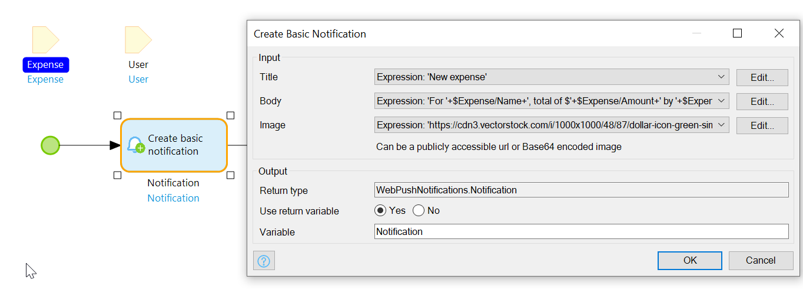

## 1 Overview

To send a notification to a user you can use the java action "SendNotification".

This action encrypts then sends a notification to the specified user. The user has to have a valid subscription for this call to succeed.

The action returns a UUID of the sent notification, which can be used to track the status and get an error message (for asynchronous execution).

The action accept a Notification object as the first parameter. The Notificatioin entity contains all input data for the notification, such as title, body, and image.

You must use the **CreateBasicNotification** microflow to generate this entity. The Notification object that is returned from the microlfow action can then be further customized before sending.

| Parameter | Description |
| --- | --- |
| Title | The title of the message. |
| Body | The extended text of the notification. |
| Icon,Image | A custom icon or image to show on the notification. |
| Badge | The number to show on the app icon. |
| Vibrate | If true will cause the app device to vibrate (if the device has that capability) |
| Dir | Text direction, defaults to "ltr". |
| Lang | Specify the notification language. |
| RequireInteraction | If true the notification will stay on the screen until the user interacts with it. |
| Silent | If true no sound will be played when the notification arrives. |

Sending a web push notifications involves a rest call and is therefore recommended to run it asynchronously (which is the default setting). Also, it is advised to continue on errors (default setting).
